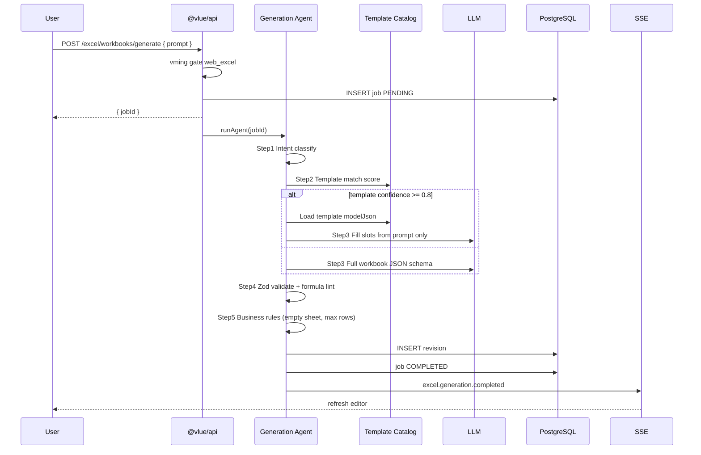

# AI 엑셀 에디터 — 시스템 아키텍처 (VLUE)

> **제품 포지션:** 직장인 실무 생산성 OS의 **웹 전용** 핵심 기능  
> **상위 원칙:** [SERVICE_ARCHITECTURE.md](./SERVICE_ARCHITECTURE.md) — 모든 클라이언트 → `@vlue/api`, 단일 사용자 데이터 상태

---

## 0. 현재 프로젝트 호환성 검토 (@vlue_service)

### ✅ 그대로 재사용 가능

| 영역 | 현재 구현 | AI 엑셀 에디터와의 관계 |
|------|-----------|-------------------------|
| API 서버 | `apps/api` — Hono, `@vlue/api` | `/api/office/*` 하위에 엑셀 라우트 추가 |
| DB | PostgreSQL + Prisma (`packages/db`) | 신규 `office_excel_*` 테이블 마이그레이션 |
| 인증 | JWT + `requireUserHeader` | 워크북 `owner_user_id`와 동일 게이트 |
| 개인 자료실 | `AssetFile`, `ingestPptVaultBuffer` 패턴 | 완성 `.xlsx` → `ingestExcelVaultBuffer` 동일 파이프 |
| 오피스 PPT | `office_ppt_tasks` + SSE 진행률 | **동일 비동기·푸시 패턴**을 생성 Job에 복제 |
| AI 사용량 | `vming` — `featureType: web_ppt` | `web_excel` FeatureType 추가 |
| 웹 앱 | `web/src/App.jsx` + `components/office/` | `OfficeExcelEditorPanel` (PPT 패널 옆) |
| 마케팅 진입 | `web/src/site/bolt` — `#exceleditor` | 로그인 후 `/app` 오피스 탭으로 딥링크 |
| 실시간 (1차) | `sseHub` + `/api/realtime/sse` | 셀 패치·Job 진행·버전 갱신 이벤트 |

### ⚠️ 설계 조정 권장 (요청 스택 vs 현재 스택)

| 요청 | 현재 VLUE | 권장 |
|------|-----------|------|
| **Socket.io** | 미사용. 사용자 이벤트는 **SSE**, PC 에이전트는 **`ws`** (`/api/office/ws/agent`) | **MVP:** REST patch + SSE `excel.workbook.updated`. **2차:** 동일 Node `ws`에 `workbook` 채널 추가 또는 Socket.io 도입 |
| **Node 백엔드** | Hono (Express 아님) | ExcelJS는 `@vlue/api` 워크스페이스에 설치 |
| **Handsontable** | 미설치, 상용 라이선스 이슈 | **MVP: FortuneSheet** (`@fortune-sheet/react`) — 오픈소스, 시트 UI에 적합 |
| **SheetJS** | 미설치 | **서버 export: ExcelJS** (브랜딩·시트 추가에 유리). 클라이언트 import는 2차 |

### ❌ 아직 없음 (신규 구축)

- 엑셀 워크북 JSON 스키마·버전 테이블
- 프롬프트 → 구조화 JSON **에이전트** 파이프라인
- 표준 업무 템플릿 카탈로그 (공구 취합, 입금 대조, 매출 요약 등)
- 웹 인라인 에디터 + 플랫폼 간 동기화 채널

**결론:** 아키텍처 방향은 **확정 SERVICE_ARCHITECTURE와 100% 정합**. PPT 오피스 모듈을 **직접 복제·확장**하는 것이 최단 경로이며, Socket.io는 1차 MVP 필수가 아니라 **SSE로 동일 UX(즉시 반영)**를 먼저 맞춘 뒤 도입해도 된다.

---

## 1. 제품 철학 및 목표 (구현 관점)

```
[자연어 프롬프트]
       ↓
[템플릿 매핑 + AI 구조화 JSON]
       ↓
[VLUE Workbook Model] ←── 실시간 편집 (웹/PC/모바일)
       ↓
[Revision 저장 + SSE 브로드캐스트]
       ↓
[ExcelJS .xlsx export + 브랜딩 시트]
       ↓
[AssetFile 개인자료실]
```

| 목표 | 기술적 정의 |
|------|-------------|
| 완성 xlsx 생성 | 서버 `WorkbookModel` → ExcelJS `writeBuffer()` |
| 수정 가능 에디터 | FortuneSheet가 편집하는 **단일 JSON 스냅샷** = DB `head_revision` |
| 플랫폼 동기화 | `workbookId` 단위 revision + SSE (추후 WS room) |
| 차별점 | 파일 1회 생성이 아니라 **지속 편집·버전·감사 로그** |

---

## 2. 시스템 아키텍처

```mermaid
flowchart TB
  subgraph clients [Clients]
    WWW[www.vlue.kr / bolt]
    APP[web App.jsx /app]
    PC[PC Agent optional viewer]
    MOB[Mobile WebView]
  end

  subgraph api [@vlue/api Hono]
    OFFICE[/api/office/excel/*]
    VMING[/api/vming/check web_excel]
    SSE[/api/realtime/sse]
    EXPORT[excelExportService ExcelJS]
    AGENT[excelGenerationAgent]
  end

  subgraph data [Data]
    PG[(PostgreSQL)]
    VAULT[(Storage / personal-vault)]
    REDIS[(Redis optional lock)]
  end

  subgraph ai [AI]
    LLM[LLM Provider]
    TPL[Template Catalog JSON]
  end

  WWW -->|로그인 후| APP
  APP --> OFFICE
  APP --> SSE
  OFFICE --> AGENT
  AGENT --> TPL
  AGENT --> LLM
  AGENT --> PG
  OFFICE --> EXPORT
  EXPORT --> VAULT
  OFFICE --> PG
  SSE --> APP
  SSE --> MOB
```

### 2.1 레이어 책임

| 레이어 | 책임 |
|--------|------|
| **Presentation** | FortuneSheet UI, 프롬프트 입력, Job 진행 UI, 다운로드 버튼 |
| **API** | CRUD workbook, revision patch, generate, export, list templates |
| **Domain** | WorkbookModel 검증, 템플릿 merge, revision conflict, 브랜딩 규칙 |
| **Agent** | Intent → templateId → structured JSON (Zod schema) |
| **Infrastructure** | Prisma, storage, SSE, (2차) WS |

### 2.2 VLUE Workbook Model (내부 JSON)

PPT와 달리 **셀 단위 편집**이 핵심이므로, FortuneSheet 호환 구조를 권장한다.

```typescript
// packages/shared — 개념 스키마
interface VlueWorkbookModel {
  meta: {
    title: string;
    templateId?: string;
    locale: "ko-KR";
    createdBy: "ai" | "user" | "import";
  };
  sheets: Array<{
    id: string;
    name: string;
    rowCount: number;
    columnCount: number;
    /** sparse: "r{c}c{r}" -> { v, f?, s? } */
    cellData: Record<string, { v?: string | number; f?: string; s?: CellStyleRef }>;
    merges?: Array<{ r: number; c: number; rs: number; cs: number }>;
    columnWidths?: Record<number, number>;
  }>;
  namedRanges?: Record<string, string>;
}
```

- **AI 출력:** 위 JSON만 생성 (바이너리 xlsx 직접 생성 X → 검증·재시도 용이)
- **에디터:** FortuneSheet `data` prop ↔ API `GET/PUT` revision body
- **Export:** ExcelJS가 동일 모델을 읽어 물리 xlsx 생성

---

## 3. DB Schema (버전 관리 포함)

### 3.1 ER 개요

```
office_excel_workbooks 1 ── * office_excel_revisions
office_excel_workbooks 1 ── * office_excel_generation_jobs
office_excel_templates (catalog, static/DB)
office_excel_workbooks ── optional ── asset_files (export 결과)
```

### 3.2 Prisma 모델 (권장)

```prisma
enum ExcelWorkbookStatus {
  draft
  active
  archived
}

enum ExcelGenerationStatus {
  PENDING
  PROCESSING
  COMPLETED
  FAILED
}

model OfficeExcelWorkbook {
  id              String   @id @default(uuid()) @db.Uuid
  ownerUserId     String   @map("owner_user_id") @db.Uuid
  title           String   @db.VarChar(300)
  templateId      String?  @map("template_id") @db.VarChar(80)
  status          ExcelWorkbookStatus @default(draft)
  headRevisionId  String?  @map("head_revision_id") @db.Uuid
  headRevisionNum Int      @default(0) @map("head_revision_num")
  lastExportedAssetId String? @map("last_exported_asset_id") @db.Uuid
  createdAt       DateTime @default(now()) @map("created_at")
  updatedAt       DateTime @updatedAt @map("updated_at")

  revisions OfficeExcelRevision[]
  jobs      OfficeExcelGenerationJob[]

  @@index([ownerUserId, updatedAt(sort: Desc)])
  @@map("office_excel_workbooks")
}

model OfficeExcelRevision {
  id           String   @id @default(uuid()) @db.Uuid
  workbookId   String   @map("workbook_id") @db.Uuid
  revisionNum  Int      @map("revision_num")
  parentRevisionId String? @map("parent_revision_id") @db.Uuid
  modelJson    Json     @map("model_json") @db.JsonB
  patchJson    Json?    @map("patch_json") @db.JsonB  // RFC6902 or cell-delta
  changeSummary String? @map("change_summary") @db.VarChar(500)
  authorUserId String   @map("author_user_id") @db.Uuid
  authorClient String   @map("author_client") @db.VarChar(20) // web | pc | mobile
  createdAt    DateTime @default(now()) @map("created_at")

  workbook OfficeExcelWorkbook @relation(fields: [workbookId], references: [id], onDelete: Cascade)

  @@unique([workbookId, revisionNum])
  @@index([workbookId, revisionNum(sort: Desc)])
  @@map("office_excel_revisions")
}

model OfficeExcelGenerationJob {
  id            String   @id @default(uuid()) @db.Uuid
  workbookId    String?  @map("workbook_id") @db.Uuid
  ownerUserId   String   @map("owner_user_id") @db.Uuid
  promptText    String   @map("prompt_text") @db.Text
  templateId    String?  @map("template_id") @db.VarChar(80)
  status        ExcelGenerationStatus @default(PENDING)
  progress      Int      @default(0)
  resultRevisionId String? @map("result_revision_id") @db.Uuid
  errorMessage  String?  @map("error_message") @db.VarChar(500)
  agentTraceJson Json?   @map("agent_trace_json") @db.JsonB
  createdAt     DateTime @default(now()) @map("created_at")
  updatedAt     DateTime @updatedAt @map("updated_at")

  workbook OfficeExcelWorkbook? @relation(fields: [workbookId], references: [id])

  @@index([ownerUserId, createdAt(sort: Desc)])
  @@map("office_excel_generation_jobs")
}

model OfficeExcelTemplate {
  id          String   @id @db.VarChar(80)
  category    String   @db.VarChar(40)
  title       String   @db.VarChar(200)
  description String?  @db.Text
  modelJson   Json     @map("model_json") @db.JsonB
  promptHints Json?    @map("prompt_hints") @db.JsonB
  isActive    Boolean  @default(true) @map("is_active")
  sortOrder   Int      @default(0) @map("sort_order")

  @@map("office_excel_templates")
}
```

### 3.3 버전·동기화 규칙

| 규칙 | 설명 |
|------|------|
| **Optimistic lock** | 클라이언트는 `PUT` 시 `baseRevisionNum` 전송. 불일치 시 `409 CONFLICT` + 서버 head 반환 |
| **Head pointer** | `workbooks.head_revision_id` / `head_revision_num` — 목록·동기화 기준 |
| **Patch vs Full** | MVP: 전체 `modelJson` 스냅샷 저장. 2차: 셀 단위 `patchJson`만 append |
| **Retention** | 사용자당 최근 N revision 유지 (예: 50), 이전은 archive job |
| **Export** | export 시점 `head_revision_id` 스냅샷 고정 → AssetFile 생성 |

### 3.4 Redis (선택, 2차)

- Key: `excel:lock:{workbookId}` — 동시 편집 시 짧은 lease (30s)
- Pub/Sub: Socket.io 도입 시 room fan-out 보조

---

## 4. AI 에이전트 흐름 (프롬프트 → 엑셀 구조)



### 4.1 단계별 정의

| Step | 이름 | 입력 | 출력 |
|------|------|------|------|
| 1 | **Intent** | `promptText` | `{ intent, templateCandidates[], entities }` |
| 2 | **Template match** | intent + catalog | `templateId` or `null` |
| 3 | **Structure gen** | template skeleton + entities | `VlueWorkbookModel` JSON |
| 4 | **Validate** | JSON | pass / retry(max 2) / fail |
| 5 | **Persist** | model | `OfficeExcelRevision` rev=1 |
| 6 | **Notify** | workbookId | SSE + (2차) WS |

### 4.2 프롬프트 엔지니어링 (핵심)

**System prompt 고정 블록:**

- 출력은 **오직 JSON**, Markdown 금지
- 허용 함수 whitelist: `SUM`, `AVERAGE`, `IF`, `COUNT`, `VLOOKUP` …
- 시트 수 상한 (예: 5), 행 상한 (예: 5000)
- 한국어 헤더·날짜 형식 `yyyy-mm-dd`
- 템플릿 ID가 있으면 **스켈레ton 변경 금지**, 데이터 영역만 채움

**User prompt:**

```
{promptText}
---
matched_template: group_buy_order_v1
entities: { period: "2025-01", columns: ["이름","연락처","수량"] }
```

### 4.3 표준 업무 템플릿 (1차 카탈로그)

| templateId | 용도 |
|------------|------|
| `group_buy_order_v1` | 공구 주문 취합 |
| `payment_reconcile_v1` | 입금 대조 |
| `monthly_sales_v1` | 월별 매출 요약 |
| `vendor_safety_list_v1` | 거래처 안전 확인 목록 |
| `expense_report_v1` | 지출 결의 |

각 템플릿은 `office_excel_templates.model_json`에 **검증된 수식·서식** 포함.

### 4.4 오류 없는 생성 전략

1. **템플릿 우선** — 자유 생성보다 매핑 우선 (사용자 요구와 일치)
2. **Schema validation** — Zod + custom formula parser
3. **Deterministic post-process** — 합계 행, 테두리, 열 너비 자동 보정
4. **Human-in-the-loop** — 에디터에서 수정 → revision 저장 (AI 오류 복구)

---

## 5. API 설계 (office 확장)

| Method | Path | 설명 |
|--------|------|------|
| GET | `/api/office/excel/templates` | 템플릿 카탈로그 |
| POST | `/api/office/excel/workbooks` | 빈 워크북 또는 templateId로 생성 |
| GET | `/api/office/excel/workbooks` | 내 목록 |
| GET | `/api/office/excel/workbooks/:id` | head revision + meta |
| PUT | `/api/office/excel/workbooks/:id/revisions` | 저장 (baseRevisionNum 필수) |
| POST | `/api/office/excel/workbooks/generate` | AI 생성 Job 시작 |
| GET | `/api/office/excel/generation-jobs/:id` | Job 상태 |
| POST | `/api/office/excel/workbooks/:id/export` | xlsx + 브랜딩 → AssetFile |

**SSE 이벤트 타입:**

```json
{ "type": "excel.generation.progress", "jobId": "...", "progress": 40 }
{ "type": "excel.workbook.updated", "workbookId": "...", "revisionNum": 12 }
```

---

## 6. 프론트엔드 (React)

| 위치 | 파일 (신규) |
|------|-------------|
| 슈퍼앱 | `web/src/components/office/OfficeExcelEditorPanel.jsx` |
| API 클라이언트 | `web/src/lib/vlueOfficeExcelApi.js` |
| 마케팅 | `bolt/pages/ExcelEditorPage.tsx` → `/app?tab=office&tool=excel` |

**편집 루프:**

1. `GET workbook` → FortuneSheet mount
2. `onChange` debounce 800ms → `PUT revision`
3. `409` → 서버 head merge UI (충돌 안내)
4. SSE `excel.workbook.updated` → 다른 탭/기기에서 reload head

**에디터 선택:** FortuneSheet MVP. Handsontable은 엔터프라이즈 라이선스 검토 후 교체 가능.

---

## 7. Export · 브랜딩 (ExcelJS)

`apps/api/src/services/office/excel/excelExportService.ts`

1. `VlueWorkbookModel` → ExcelJS `Workbook`
2. 각 시트 데이터·수식·스타일 매핑
3. **추가 시트 `_VLUE_Info`:** `Powered by VLUE (www.vlue.kr)` + 서비스 소개 3~5행
4. **푸터(선택):** 각 시트 `footer`에 동일 문구
5. `writeBuffer()` → `ingestExcelVaultBuffer` → `AssetFile`

---

## 8. 실시간 동기화 전략

### Phase 1 (MVP) — 기존 스택

- **REST** + `baseRevisionNum` 낙관적 잠금
- **SSE** `excel.workbook.updated` (이미 `startVlueSse` 연결됨)

### Phase 2 — WebSocket

옵션 A: **기존 `ws` 확장** — `/api/office/ws/workbook?token=&workbookId=`  
옵션 B: **Socket.io** — room = `workbook:{id}`, event = `patch`

동일 메시지 페이로드:

```json
{
  "op": "cells",
  "revisionNum": 13,
  "cells": [{ "sheetId": "s1", "r": 2, "c": 3, "v": 15000 }]
}
```

**SERVICE_ARCHITECTURE 문서와의 정합:** 채팅·리모컨은 WS, 엑셀은 **문서 CRDT가 아닌 revision 기반**이므로 SSE만으로도 “즉시 반영” UX 가능. 다만 **동시 편집**이 많으면 Phase 2 WS 권장.

---

## 9. MVP 로드맵 (1차 개발)

### Week 0 — 설계 고정 (현재)

- [x] 본 문서
- [ ] `packages/shared` Zod schema
- [ ] 템플릿 2종 JSON 시드 (공구 취합, 입금 대조)

### Week 1 — 백엔드 골격 ✅ (2026-06-02)

**의존성:**

```bash
npm install zod@^3.24.2 -w @vlue/shared
npm install exceljs@^4.4.0 zod@^3.24.2 -w @vlue/api
```

**완료 파일:**

1. `packages/db/prisma/migrations/20260602170000_office_excel/migration.sql`
2. `packages/db/prisma/schema.prisma` — Office Excel 모델
3. `packages/shared/src/excel/workbookSchema.ts`
4. `apps/api/src/data/officeExcelTemplatesCatalog.ts`
5. `apps/api/src/services/office/excel/workbook.service.ts`
6. `apps/api/src/services/office/excel/generationAgent.service.ts` (Mock)
7. `apps/api/src/services/office/excel/templateResolver.ts`
8. `apps/api/src/routes/officeExcel.ts` + `office.ts` mount `/excel`
9. `excelExportService.ts` — Week 3
10. `web_excel` vming — Week 3

### Week 2 — 프론트 MVP

**의존성 (`web`):**

```bash
npm install @fortune-sheet/react fortune-sheet -w @vlue/web
```

**생성 파일:**

1. `web/src/lib/vlueOfficeExcelApi.js`
2. `web/src/components/office/OfficeExcelEditorPanel.jsx`
3. `web/src/App.jsx` — 오피스 탭에 패널 연결
4. `bolt/pages/ExcelEditorPage.tsx` — CTA를 `/app?tool=excel`로 변경

### Week 3 — AI · 브랜딩 · 연동

1. 실 LLM 연동 (`apps/api/src/routes/ai.ts` 또는 전용 agent service)
2. Export + 개인자료실 연동
3. SSE 이벤트 E2E
4. vming 한도·과금 정책

### Week 4 — 동기화 2차 (선택)

```bash
npm install socket.io socket.io-client -w @vlue/api -w @vlue/web
```

- workbook room
- PC/모바일 WebView 동일 JS 번들 사용 시 자동 동기화

---

## 10. 보안 · 멀티테넌시

- 모든 쿼리에 `owner_user_id = vlueUserId` 강제
- `modelJson` 크기 상한 (예: 2MB)
- formula injection 방지 — `=cmd|`, external link 차단
- export URL은 signed URL 또는 인증 다운로드

---

## 11. 체크리스트 (SERVICE_ARCHITECTURE 반영)

| 항목 | MVP 후 상태 |
|------|-------------|
| www 웹 전용 UI | `OfficeExcelEditorPanel` + bolt 진입 |
| @vlue/api 단일 소스 | office excel routes |
| 개인자료실 연동 | export → `AssetFile` |
| 실시간 | SSE (WS 2차) |
| 앱과 동일 데이터 | 동일 JWT + 동일 workbookId |

---

## 12. 참고 코드 (현재 레포)

| 참고 | 경로 |
|------|------|
| PPT Task + SSE | `apps/api/src/services/office/officePptTaskService.ts` |
| Vault ingest | `apps/api/src/services/office/officeVaultIngest.ts` |
| Office routes | `apps/api/src/routes/office.ts` |
| PPT UI | `web/src/components/office/OfficePptWorkshopPanel.jsx` |
| SSE 클라이언트 | `web/src/lib/vlueSse.js` |
| 마케팅 진입 | `web/src/site/bolt/pages/ExcelEditorPage.tsx` |
