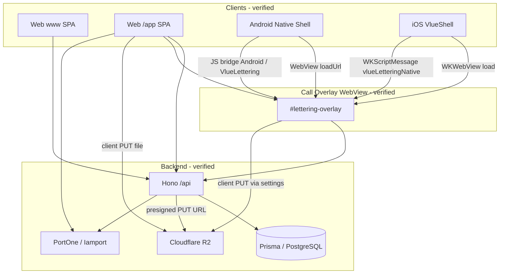
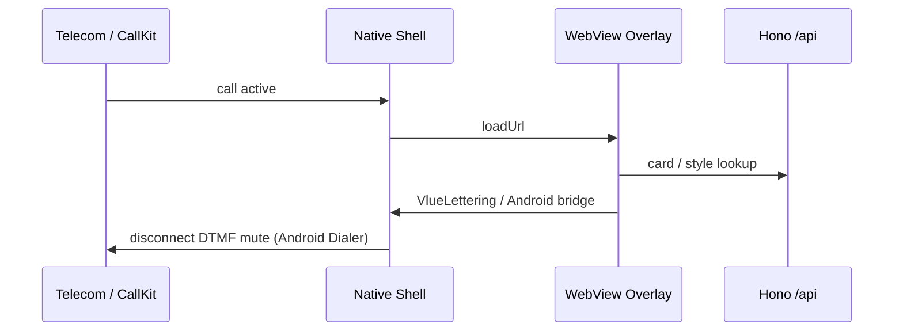
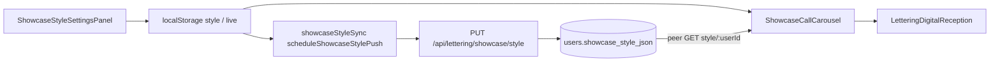
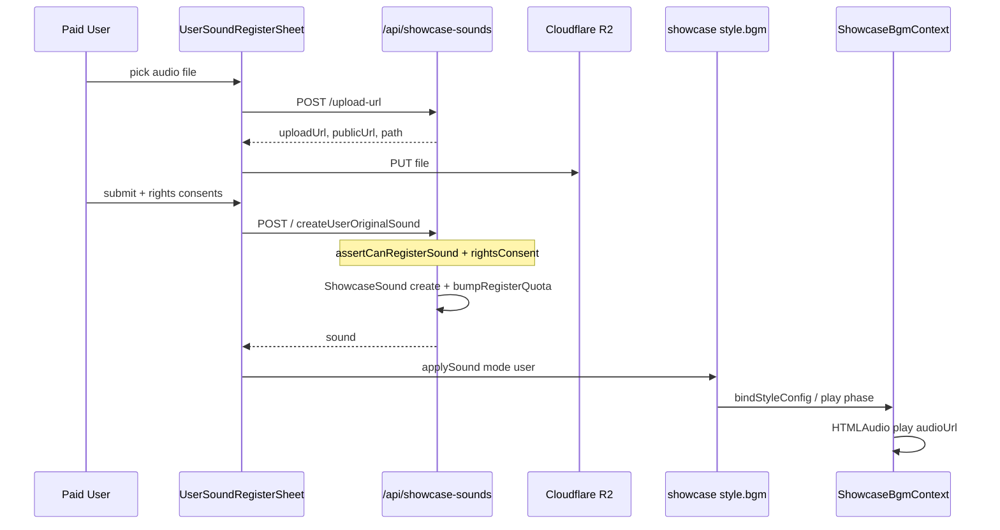
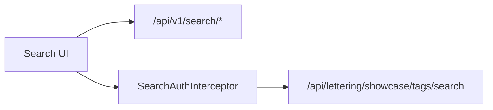

# VLUE Technical Architecture

> **작성 기준:** 현재 코드·API·네이티브 구현을 직접 대조.  
> **제품 범위 기준:** `docs/VLUE_PRODUCT_OVERVIEW.md`, `docs/VLUE_FEATURE_MATRIX.md`  
> **우선순위:** 문서와 코드가 다르면 **코드**를 우선하고 차이를 명시.  
> **상태:** `[완료]` `[부분 구현]` `[출시 전 필수]` `[V2]` `[미구현]` `[확인 필요]`

---

## 1. 문서 목적 및 검증 기준

| 목적 | 내용 |
|------|------|
| 목적 | V1 출시·운영을 위한 **실제 구현** 기술 구조 기록 |
| 포함 | 코드에 존재하는 모듈·라우트·브리지·Prisma 모델·R2 업로드 |
| 제외 | 추정 마이크로서비스, 미존재 테이블/버킷, 미래 설계 |
| 대조 원칙 | Overview/Matrix는 기능 목록 기준 · 기술 사실은 코드 우선 |

**검증에 사용한 주요 경로**

| 영역 | 경로 |
|------|------|
| V1 플래그 | `web/src/lib/v1ReleaseScope.js` |
| API 엔트리 | `apps/api/src/index.ts`, `apps/api/src/routes/api.ts` |
| DB | `packages/db/prisma/schema.prisma` |
| Android | `apps/android/app/src/main/java/kr/vlue/calloverlay/` |
| iOS 셸 | `apps/ios/VlueShell/` |
| 음원 | `web/src/lib/showcase/showcaseSoundApi.js`, `apps/api/src/routes/showcaseSounds.ts` |

---

## 2. 전체 시스템 아키텍처

코드로 확인된 실행 단위:

| 단위 | 역할 | 상태 |
|------|------|------|
| **Web SPA** (`web/`) | Vite React — www 마케팅 + `/app` 앱 UI + `#lettering-overlay` | `[완료]` |
| **API** (`apps/api/`) | Hono · `/api` · Prisma · PortOne · R2 서명 URL | `[완료]` |
| **DB** (`packages/db`) | PostgreSQL (Prisma) | `[완료]` |
| **Android 셸** | WebView 오버레이 + InCallService + DialerRole + Family 네이티브 | `[부분 구현]` / 실기기 `[출시 전 필수]` |
| **iOS 셸** | CallKit 관찰 + 전면 WebView 오버레이 + Family 브릿지 | `[부분 구현]` |
| **R2** | 이미지·영상·쇼케이스 음원 Direct Upload | `[완료]` (환경 설정 의존) |

**차이 명시:** Overview의 “앱”은 별도 네이티브 UI가 아니라 **네이티브 셸 + `/app` WebView(및 오버레이 WebView)** 구조이다.

---

## 3. 플랫폼별 실행 구조

### 3.1 Web

| 항목 | 내용 | 상태 |
|------|------|------|
| 스택 | Vite · React (`web/src`) | `[완료]` |
| 마케팅 | `web/src/site/bolt/` — Search, Pricing, Support 등 | `[완료]` |
| 앱 UI | `web/src/App.jsx` — `/app` 해시 라우팅 | `[완료]` |
| V1 게이트 | `v1ReleaseScope.js` · `coerceWebViewForV1` / `coerceAppPageForV1` | `[완료]` |
| 웹 구독 결제 | `v1WebShell.webSubscribePayment === false` | `[V2]` |

### 3.2 Android Native

| 구성 | 파일 | 상태 |
|------|------|------|
| 오버레이 서비스 | `CallOverlayService.kt` | `[완료]` |
| 오버레이 URL | `VlueLetteringConfig.overlayUrl` → `{WEB_BASE}/app#lettering-overlay?...&platform=android&native=1` | `[완료]` |
| JS 브릿지 | `LetteringJavascriptBridge.kt` — `window.Android` + inject `window.VlueLettering` | `[완료]` |
| InCall | `VlueInCallService.kt`, `VlueInCallController.kt` | `[부분 구현]` |
| 기본 전화앱 | `DialerRoleHelper.kt` — `ROLE_DIALER` | `[부분 구현]` → `[출시 전 필수]` |
| 근접 센서 | `ShowcaseProximitySensor.kt` → `window.VlueShowcaseBridge.onProximityNear/Far` | `[부분 구현]` → `[출시 전 필수]` |
| 가족 | `family/*`, `VlueFamilyBridge.kt` | `[부분 구현]` |

**참고:** `apps/android-call-overlay/` 트리가 별도로 존재한다. 주 경로로 확인된 것은 `apps/android/app/.../calloverlay/`. 대체 트리 동기화 여부는 `[확인 필요]`.

### 3.3 iOS Native

| 구성 | 파일 | 상태 |
|------|------|------|
| CallKit 관찰·오버레이 | `apps/ios/VlueShell/Lettering/LetteringCallKitOverlay.swift` | `[부분 구현]` |
| 오버레이 URL | `VlueLetteringConfig` → `{webBase}/app#lettering-overlay?...&platform=ios&native=1` | `[완료]` |
| 메시지 핸들러 | `vlueLetteringNative` — `endCallKeepOverlay`, `endCall`, `revealSystemCallUi`, `restoreShowcaseOverlay`, `speaker`, `dismiss` 등 | `[완료]` |
| Family | `VlueFamilyBridge.swift`, `VlueFamilyBridgeMessageHandler.swift` | `[부분 구현]` |
| 기본 전화앱 교체 | OS 정책상 불가 | `[미구현]` |

**참고:** `apps/ios-lettering/`에 별도 presenter가 있다. URL에 `/app` 유무가 셸과 다를 수 있음 → `[확인 필요]` (어느 바이너리가 스토어 빌드인지).

### 3.4 WebView · Overlay Host

| 항목 | 내용 | 상태 |
|------|------|------|
| 엔트리 | `App.jsx`: hash `#lettering-overlay` → `<LetteringOverlayHost />` | `[완료]` |
| Host | `LetteringOverlayHost.jsx` — lettering 비활성·차단번호면 `null` | `[완료]` |
| 파라미터 | `incoming`/`phone`, `platform`, `direction`, `native`, `phase` | `[완료]` |
| verified | 네이티브 URL에 포함되나 Host `parseOverlayParams`는 **미사용** — 카드 lookup 결과 사용 | 문서·네이티브 차이 **코드 우선** |

### 3.5 Native ↔ WebView Bridge

| 방향 | 메커니즘 | 상태 |
|------|----------|------|
| Web → Native | `web/src/lib/call/nativeCallControl.js` — `window.VlueLettering.*` 후 `window.Android.*` | `[완료]` |
| 호출 메서드(확인됨) | `answerCall`, `endCallKeepOverlay`, `endCallOnly`, `endCall`, `dismissOverlay`, `setOverlayFullscreen`, `setMicrophoneMute`, `setSpeakerphoneOn`, `playDtmfTone`, `stopDtmfTone`, `revealSystemCallUi`, `restoreShowcaseOverlay`, `getInCallCapabilityJson`, `requestDefaultDialerRole` 등 | `[완료]` |
| Native → Web (Android) | `VlueLettering.onNativeCallState`, CustomEvent `vlue-native-call-state` | `[완료]` |
| Native → Web (근접) | `VlueShowcaseBridge.onProximityNear/Far` | `[완료]` |
| iOS → Web | `webkit.messageHandlers.vlueLetteringNative.postMessage` | `[완료]` |

---

## 4. 인증 및 계정 바인딩 아키텍처

| 단계 | 구현 | 상태 |
|------|------|------|
| 클라 본인인증 | `iamportClient.js` — `IMP.certification` (예: `inicis_unified`) | `[완료]` |
| 온보딩 UI | `VlueOnboarding.jsx` | `[완료]` |
| 서버 완료 | `POST /api/identity/portone/complete` — `routes/identity.ts` → `identityPortone` / `iamportCert` | `[완료]` |
| 결과 | user 생성·갱신, CI 해시, 전화번호, 선택적 digital card, 토큰 | `[완료]` |
| API 인증 | Bearer JWT (`authContext.ts`) · 비strict 시 `X-VLUE-User-Id` 폴백 | `[완료]` |
| 보호자 PASS | `auth` parental-consent · `guardianImpUid` | `[부분 구현]` |

**상태:** 코드 경로 `[완료]` · 운영 키·실기기 `[출시 전 필수]`

---

## 5. PSTN 통화 및 통화 인터페이스 아키텍처

| 계층 | 구현 | 상태 |
|------|------|------|
| UI 셸 | `LetteringIncomingNotification.jsx`, `ShowcaseCallCarousel.jsx` | `[완료]` |
| InCall UI | `InCallControlBar.jsx`, `InCallDtmfPad.jsx` | `[완료]` |
| Peer 매트릭스 | `callPeerMatrix.js` — 카톡 Share 슬롯 조건 | `[완료]` |
| 카톡 Share | `shareShowcaseInviteKakao.js`, `InCallKakaoShareSlot.jsx` | `[완료]` |
| Android Dialer | `ROLE_DIALER` 필수 시 DTMF/`Call.disconnect` | `[부분 구현]` → `[출시 전 필수]` |
| Android 문서 | `docs/v1_incall_android_ios.md` | 코드와 정합 |
| iOS | CallKit 전면 오버레이 + 스와이프 업 순정 UI | `[부분 구현]` |
| 알림톡 핸드오프 | QA: V1 미사용 | V1 범위 외 / Share로 대체 |

**본인 미리보기:** `inCallChromePreview` + `InCallControlBar` `demoMode` — 실 PSTN 없음. `[완료]`

---

## 6. Showcase 및 Digital Business Card 아키텍처

### 6.1 데이터 저장 (확인됨)

| 저장소 | 내용 | 상태 |
|--------|------|------|
| localStorage | 편집/라이브 스타일 (`showcaseStyleStorage.js`, `writeLiveShowcaseStyle`) | `[완료]` |
| 서버 동기화 | `GET/PUT /api/lettering/showcase/style` — `showcaseStyleApi.js` · `showcaseStyleSync.js` · `showcaseStyleSyncService` | `[완료]` |
| DB | `users.showcase_style_json` (`schema.prisma`) — **별도 `showcase` 테이블 없음** | `[완료]` |
| 디지털 명함 | Prisma `digital_cards` · `LetteringDigitalReception.jsx` · lettering bizcard storage | `[완료]` |
| 마이케이스 | `/api/mycase` · `syncMycaseLiveBroadcast.js` · 로컬 `vlue_mycase_live_broadcast_v1` | `[완료]` |
| 소셜 | `/api/lettering/showcase/social/...` · `showcaseSocialApi.js` | `[완료]` |
| 팔로우 | `/api/follow` · `user_follows` | `[완료]` |
| 권한 | `showcaseStylePermissions.js` · `ShowcasePremiumGateModal` | `[완료]` |

### 6.2 통화 시 카드 조회

| 항목 | 내용 | 상태 |
|------|------|------|
| Overlay Host | 번호로 카드/스타일 resolve | `[완료]` |
| Android lookup | `CardLookupBridge.kt` / `CardLookupRepository.kt` | `[완료]` |
| 상세 매칭 우선순위 | 번호 정규화·캐시 정책 | 세부 알고리즘 `[확인 필요]` (파일 존재는 확인) |

---

## 7. BGM 및 User Original Sound 아키텍처

### 7.1 구성 요소 (확인됨)

| 구성 | 경로 | 상태 |
|------|------|------|
| Picker UI | `ShowcaseBgmPicker.jsx` | `[완료]` |
| 재생 컨텍스트 | `ShowcaseBgmContext.jsx` — `HTMLAudioElement` | `[완료]` |
| 클라 API | `showcaseSoundApi.js` | `[완료]` |
| API | `/api/showcase-sounds` — `showcaseSounds.ts` | `[완료]` |
| 서비스·스토리지 | `showcaseSoundService.ts`, `showcaseSoundStorage.ts` | `[완료]` |
| Prisma | `showcase_sounds`, `showcase_sound_borrows`, `showcase_sound_quota_months` | `[완료]` |
| 스타일 BGM 필드 | `mode`, `soundId`, `audioUrl`, `playlist`, `playMode` … | `[완료]` |

**정적 `SHOWCASE_BGM_PRESETS = []`:** 레거시 상수. V1 카탈로그는 `GET /signature` API. Overview와 일치.

### 7.2 모드

| mode | 의미 | 상태 |
|------|------|------|
| `signature` | VLUE Signature | `[완료]` |
| `user` | User Original (본인 업로드) | `[완료]` **V1** |
| `borrowed` | Shared Track (퍼오기) | `[완료]` |
| `none` | 없음 / 끊김 | `[완료]` |

### 7.3 User Original Sound — 코드 대조 흐름

Overview/Matrix가 요구한 단계와 **실제 코드** 대조:

| 단계 | 코드 근거 | 상태 |
|------|-----------|------|
| 유료 사용자 | Picker: `paid`일 때만 「음원 등록」 | `[완료]` |
| 음원 등록 UI | `UserSoundRegisterSheet` · `setRegisterOpen(true)` | `[완료]` |
| 파일 업로드 | `uploadShowcaseSoundFile` → `POST /upload-url` → 클라 `PUT` R2 | `[완료]` |
| 권리·동의 | UI: `consent`, `consentRights`, `consentThird`, (+AI `consentAi`). API: `rightsConsent` 필수, AI 시 `commercialUseClaimed` | `[완료]` |
| 쿼터 검증 | **등록 시** `assertCanRegisterSound` (유료·일 3·보관 10). `upload-url` 단계에는 멤버 쿼터 없음 | `[완료]` (시점 주의) |
| 음원 저장 | R2 객체 + `prisma.showcaseSound.create` (`kind: user_original`) | `[완료]` |
| Original Track | `GET /mine` → `owned[]` | `[완료]` |
| 쇼케이스 BGM 연결 | `applySound(sound, "user")` → `soundToBgmPatch` → `persist({ bgm })` | `[완료]` |
| 재생 | `ShowcaseBgmContext` → `audioUrl` / 없으면 `GET /:soundId`로 DB URL 재조회 | `[완료]` |

**명시적 한계 (추측 금지 · 코드 사실)**

| 항목 | 사실 | 표기 |
|------|------|------|
| upload-url 시 쿼터 | 멤버 쿼터 미검사 (MIME·80MB·R2만) | 등록 실패 시 R2 고아 객체 정리 `[확인 필요]` |
| “Signed URL 재생” | 재생은 DB에 저장된 **`publicUrl`(`audioUrl`)** 사용. R2 GET 재서명은 재생 경로에 없음 | 코드 우선 |
| Shared Track ownerHandle | `serializeShowcaseSound`에 handle 누락 가능 → 표시 `[확인 필요]` | |
| 무료 | 업로드 불가 · Signature·borrow만 | `[완료]` |

### 7.4 Signature / Shared

| 기능 | API | 상태 |
|------|-----|------|
| Signature 목록 | `GET /api/showcase-sounds/signature` | `[완료]` |
| Shared 퍼오기 | `POST /api/showcase-sounds/:soundId/borrow` → `ShowcaseSoundBorrow` | `[완료]` |
| 쿼터 조회 | `GET /api/showcase-sounds/quota` | `[완료]` |
| 테마 변경(무료 주 1회) | `POST /theme-change` | `[완료]` |

### 7.5 통화 중 BGM

| 동작 | 코드 | 상태 |
|------|------|------|
| `call_active` 강제 뮤트 | `ShowcaseBgmContext` | `[완료]` |
| 종료 후 재생 | phase `replay` 등 | `[부분 구현]` / QA `[출시 전 필수]` |

---

## 8. Membership · Entitlement · Premium Gate 아키텍처

| 계층 | 구현 | 상태 |
|------|------|------|
| 요금·카피 상수 | `membershipBm.js`, `membershipBenefits.js` | `[완료]` |
| 티어 판별 | `letteringMembership.js` — `isPaidLetteringTier` | `[완료]` |
| 쇼케이스 권한 | `getShowcasePermissions` / `requiresPremium` | `[완료]` |
| 페이지 한도 | `tentShowcaseTypes.js` — free 1 / paid 10 | `[완료]` |
| UI 게이트 | `ShowcasePremiumGateModal` | `[완료]` |
| API 게이트 | `cardGate.requirePremiumTier`, `membershipFeatureGate` (chat/shop 등 V2 영역) | `[완료]` |
| DB | `user_subscriptions` 등 — **`membership` 단일 테이블 없음** | `[완료]` |
| 추천인 | `referralProgram: false` | `[V2]` / 미운영 |

---

## 9. 결제 아키텍처

| 경로 | 구현 | V1/V2 | 상태 |
|------|------|-------|------|
| 앱 구독 | `PostSignupPaymentModal` → billing → `POST /api/payment/subscribe/complete` | **V1** | `[완료]` 코드 / `[출시 전 필수]` 테스트 결제 |
| PortOne V2 원샷 | `POST /api/payment/v2/complete` | 별도 경로 | `[부분 구현]` 용도 범위 `[확인 필요]` |
| Webhook | `POST /api/payment/webhook` | — | `[완료]` |
| www 구독 UI | `webSubscribePayment: false` | **V2** | 비활성 |
| 구독 cron | `/api/cron` subscription | — | `[완료]` |

관련 테이블: `user_subscriptions`, `subscription_payments` (스키마 확인).

---

## 10. 검색·기관·전화번호 데이터 흐름

| 경로 | Auth | 상태 |
|------|------|------|
| `GET /api/v1/search/verify` | public | `[완료]` |
| `GET /api/v1/search/business` | public | `[완료]` |
| `GET /api/lettering/showcase/tags/search` | `SearchAuthInterceptor` (로그인·CI·active showcase·레이트리밋) | `[완료]` |
| `GET/PUT .../search-privacy` | user | `[완료]` |
| 웹 UI | `SearchPage`, `SearchVerifyCrossTabs` | `[완료]` |
| 앱 홈 검색 | `homeBizSearch` | `[완료]` |

---

## 11. 가족보호 아키텍처

| 계층 | 구현 | 상태 |
|------|------|------|
| Web | `FamilyProtectionPage.tsx` | `[부분 구현]` |
| App UI | `FamilyProtectionRegister.jsx` 등 | `[부분 구현]` |
| API | `/api/family-protection`, `/api/family/invite`, `/api/family-cross-security` | `[부분 구현]` |
| DB | `family_protection_*`, `family_bank_*`, `family_ward_presence`, `family_protection_alerts` | `[완료]` 스키마 |
| Android | `family/*` 스캐너·통화·배터리·브릿지 | `[부분 구현]` |
| iOS | `VlueFamilyBridge*` | `[부분 구현]` |
| 오픈뱅킹 자동 | 문서상 후속 · webhook 라우트는 API에 존재 | 자동 E2E `[미구현]` / webhook 실연동 `[확인 필요]` |
| Entitlement | 유료 1:3 · B2B 해당 없음 (`membershipBenefits.js`) | `[완료]` 정책 상수 |

---

## 12. API · DB · Storage 계층

### 12.1 API

| 항목 | 사실 | 상태 |
|------|------|------|
| 프레임워크 | Hono (`@hono/node-server`) | `[완료]` |
| 포트 | 기본 8788 (`PORT`) | `[완료]` |
| 마운트 | `app.route("/api", apiRoutes)` | `[완료]` |

V1 관련 마운트(확인): `/identity`, `/payment`, `/lettering`, `/v1/search`, `/showcase-sounds`, `/media`, `/follow`, `/mycase`, `/family-protection`, `/auth`, `/cards`, …

V2·기타도 동일 프로세스에 마운트됨 (`/shop`, `/chat`, `/auction`, `/mail*` 등) — **런타임 제거가 아니라 클라 플래그로 비노출**. `[V2]` 경계는 §13.

### 12.2 DB (Prisma — 확인된 모델/테이블만)

| 도메인 | 테이블/컬럼 |
|--------|-------------|
| 사용자·스타일 | `users` (+ `showcase_style_json`) |
| 명함 | `digital_cards` |
| 구독 | `user_subscriptions`, `subscription_payments` |
| 음원 | `showcase_sounds`, `showcase_sound_borrows`, `showcase_sound_quota_months` |
| 팔로우 | `user_follows` |
| 가족 | `family_protection_settings`, `family_protection_links`, … |
| 케이스 | `showcase_cases` (마이케이스 — style 주저장은 users JSON) |

**없는 것:** 단일 테이블명 `membership`, `showcase` (엔티티명으로의 단독 테이블).

### 12.3 Storage

| 용도 | 구현 | Env | 상태 |
|------|------|-----|------|
| 쇼케이스 음원 | `showcaseSoundStorage.ts` — R2 presigned PUT · prefix `showcase-bgm/` | `R2_*` | `[완료]` |
| 이미지/영상 | `directImageStorage` / `directVideoStorage` · `/api/media/*-upload-url` | `R2_*` | `[완료]` |
| 기본 버킷명 | 코드 기본 `vlue-product-media` | 설정 의존 | `[확인 필요]` 운영 실제 버킷명 |
| Office mock S3 | `storageProvider.ts` Mock | `S3_*` | V1 핵심 아님 |
| Supabase bucket SQL | `supabase/migrations/...product_media_bucket.sql` | — | R2와 병행 여부 `[확인 필요]` |

---

## 13. V1/V2 기술적 경계

| 경계 | 메커니즘 | 상태 |
|------|----------|------|
| 클라 노출 | `v1ReleaseScope.js` — `v1AppShell` / `v1WebShell` / excluded views·pages | `[완료]` |
| 물리 백업 | `archive-v2/` | `[완료]` |
| API | V2 라우트도 `/api`에 마운트될 수 있음 — **서버 전면 차단 ≠ 클라 숨김** | 차이 명시 |
| 결제 | 웹 결제 off · 앱 subscribe on | `[완료]` |
| BGM | User Original **V1** · 레거시 YouTube 필드 잔존 | Overview와 정합 |

V2 예 (플래그 false): chat, vumingAi, vlueStore, auction, aiExcel, pcInstaller, referralProgram, webSubscribePayment, homeLegacyFeed, …

---

## 14. 출시 전 아키텍처 검증 지점

| ID | 검증 | 계층 | 상태 |
|----|------|------|------|
| A1 | PortOne 테스트 결제 → `subscribe/complete` → 티어 | Payment · Membership | `[출시 전 필수]` |
| A2 | Android 릴리즈 · `ROLE_DIALER` · DTMF·종료 | Native InCall | `[출시 전 필수]` |
| A3 | 근접 센서 near/far → `VlueShowcaseBridge` | Native · BGM mute | `[출시 전 필수]` |
| A4 | iOS CallKit 오버레이 · 스와이프 | iOS · Overlay | `[출시 전 필수]` (P1) |
| A5 | User Original 업로드·동의·쿼터·송출 | BGM · R2 | `[출시 전 필수]` (QA §3) |
| A6 | 통화 중 BGM mute / 종료 후 재생 | BGM Context | `[출시 전 필수]` |
| A7 | V2 메뉴·라우트 미노출 | v1ReleaseScope | `[출시 전 필수]` |
| A8 | SearchAuthInterceptor · 해시태그 검색 | Search | `[출시 전 필수]` |
| A9 | 가족보호 E2E | Family | `[출시 전 필수]` |
| A10 | R2 env 운영 설정 | Storage | `[출시 전 필수]` / 미설정 시 업로드 실패 |
| A11 | Play Store AAB | Android 빌드 | `[출시 전 필수]` |

근거: `docs/v1_mvp_final_qa_checklist.md`.

---

## 15. Architecture Verification Matrix

| Overview / Matrix 기능 | 코드·모듈·API 근거 | 아키텍처 계층 | V1/V2 | 구현 상태 | 출시 전 검증 |
|------------------------|-------------------|---------------|-------|-----------|--------------|
| PASS 본인인증 | `iamportClient.js`, `POST /api/identity/portone/complete` | Auth | V1 | `[완료]` | 실키 스모크 |
| 앱 구독 결제 | `PostSignupPaymentModal`, `POST /api/payment/subscribe/complete` | Payment | V1 | `[완료]`/`[출시 전 필수]` | A1 |
| www 구독 결제 | `webSubscribePayment: false` | Payment | V2 | 비활성 | §4-A |
| 기관·번호 검색 | `/api/v1/search/*`, lettering tags search | Search | V1 | `[완료]` | A8 |
| 통화 오버레이 | `LetteringOverlayHost`, Android/iOS loadUrl | Overlay · Native | V1 | `[완료]`/`[출시 전 필수]` | A2–A4 |
| InCall 제어 | `InCallControlBar`, `nativeCallControl.js`, `VlueInCallController` | Call UI · Bridge | V1 | `[부분 구현]` | A2 |
| ROLE_DIALER | `DialerRoleHelper.kt` | Android Native | V1 | `[부분 구현]` | A2 |
| 근접 센서 | `ShowcaseProximitySensor.kt` | Android Native | V1 | `[부분 구현]` | A3 |
| 디지털 인증명함 | `LetteringDigitalReception`, `digital_cards` | Showcase · DB | V1 유료 | `[완료]` | 결제 후 |
| 블루 쇼케이스 | Settings · Carousel · `users.showcase_style_json` | Showcase | V1 | `[완료]` | QA |
| 통화화면 미리보기 | `inCallChromePreview` | Showcase UI | V1 | `[완료]` | 회귀 |
| Premium Gate | `showcaseStylePermissions`, PremiumGateModal | Entitlement | V1 | `[완료]` | §1 |
| 해시태그 | tags API + SearchAuthInterceptor | Search · Showcase | V1 유료 | `[완료]` | A8 |
| Signature BGM | `GET /showcase-sounds/signature` | BGM | V1 | `[완료]` | A5–A6 |
| **User Original 업로드** | upload-url → R2 PUT → POST `/` → applySound | BGM · R2 · DB | **V1 유료** | `[완료]` | A5 |
| Shared Track | `POST .../borrow`, `ShowcaseSoundBorrow` | BGM | V1 | `[완료]` | A5 |
| 배너 소셜 오버레이 | `ShowcaseBannerSocialLayer`, social API | Showcase Social | V1 | `[완료]` | §13 |
| 팔로우 | `/api/follow`, `user_follows` | Social Graph | V1 | `[완료]` | §10 |
| 카톡 Share | `shareShowcaseInviteKakao` | Call · Share | V1 | `[완료]` | §8 |
| 알림톡 핸드오프 | QA 미사용 | — | V1 제외 | — | — |
| 통화 목록 | call history UI | Call History | V1 | `[완료]` | §10 |
| 개인케이스 | Resources / WalletHub | Vault | V1 | `[완료]` | §11 |
| 마이케이스 | `/api/mycase`, live broadcast sync | Showcase Live | V1 | `[완료]` | 회귀 |
| 가족보호 | family-protection API · native family | Family | V1 유료 | `[부분 구현]` | A9 |
| 명함 스캐너 | `BizcardScannerScreen` | App UI | V1 | `[완료]` | 기기 |
| 소셜 로그인 | OAuth · SocialAccountLinkPanel | Auth | V1 | `[완료]` | 실키 |
| SOHO 추가번호 | `SOHO_BROADCAST_*`, broadcastLine routes | Membership · Billing | V1 | `[부분 구현]` | §4-C |
| 스토어/채팅/엑셀 등 | flags false · archive-v2 | — | V2 | 숨김 | A7 |
| R2 미디어 | `R2_*`, media + showcaseSoundStorage | Storage | V1 | `[완료]` | A10 |

**연결 미확인 항목**

| 항목 | 이유 | 표기 |
|------|------|------|
| 운영 중 실제 R2 버킷명 | env 의존 · 기본값만 코드에 존재 | `[확인 필요]` |
| Supabase media bucket 사용 여부 | SQL 마이그레이션 존재 · 주 경로는 R2 | `[확인 필요]` |
| android-call-overlay / ios-lettering 스토어 채택 | 별도 트리 존재 | `[확인 필요]` |
| 카드 lookup 캐시·매칭 세부 | Bridge 존재 · 알고리즘 문서화 부족 | `[확인 필요]` |
| PortOne `/v2/complete`의 V1 구독 역할 | subscribe/complete와 별도 | `[확인 필요]` |

---

## 부록: Overview·Matrix와 코드 불일치로 정정된 점

| 과거 문서/오해 | 코드 사실 |
|----------------|-----------|
| QA 옛 문구 「커스텀 BGM 업로드 없음」 | User Original 업로드 **V1 구현·노출** (유료) |
| “서명 URL로만 재생” | 재생은 **public `audioUrl`**; `GET /:soundId`는 DB URL 재조회 |
| 단일 `showcase` / `membership` 테이블 | `users.showcase_style_json`, `user_subscriptions` 등 |
| 웹=앱 결제 | 웹 구독 결제 **V2 비활성** |

---

*본 문서는 코드 실측 기반이다. `[확인 필요]`는 추측으로 채우지 않았다.*
