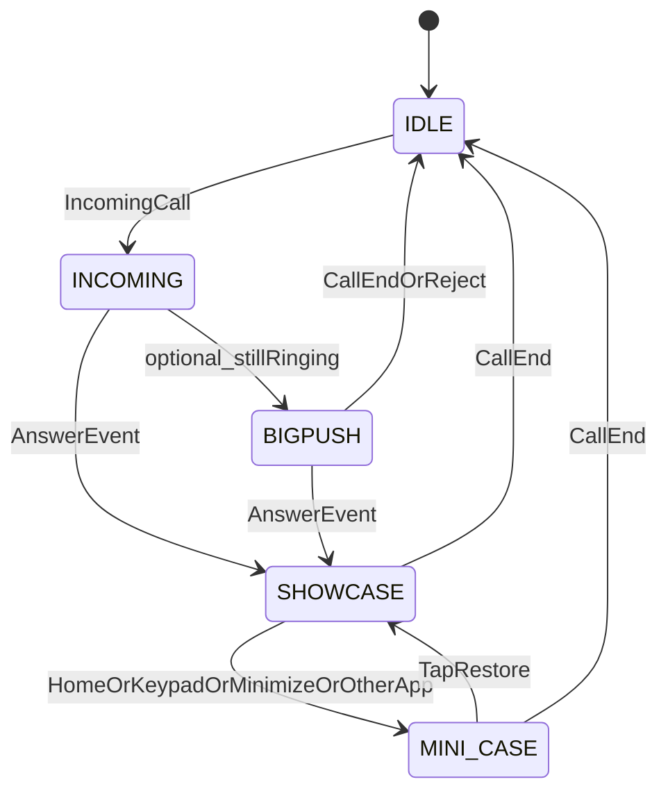
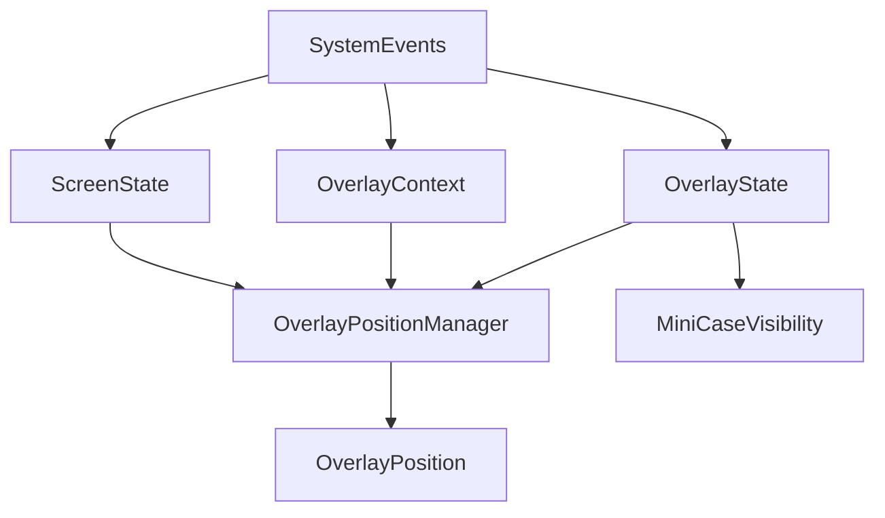
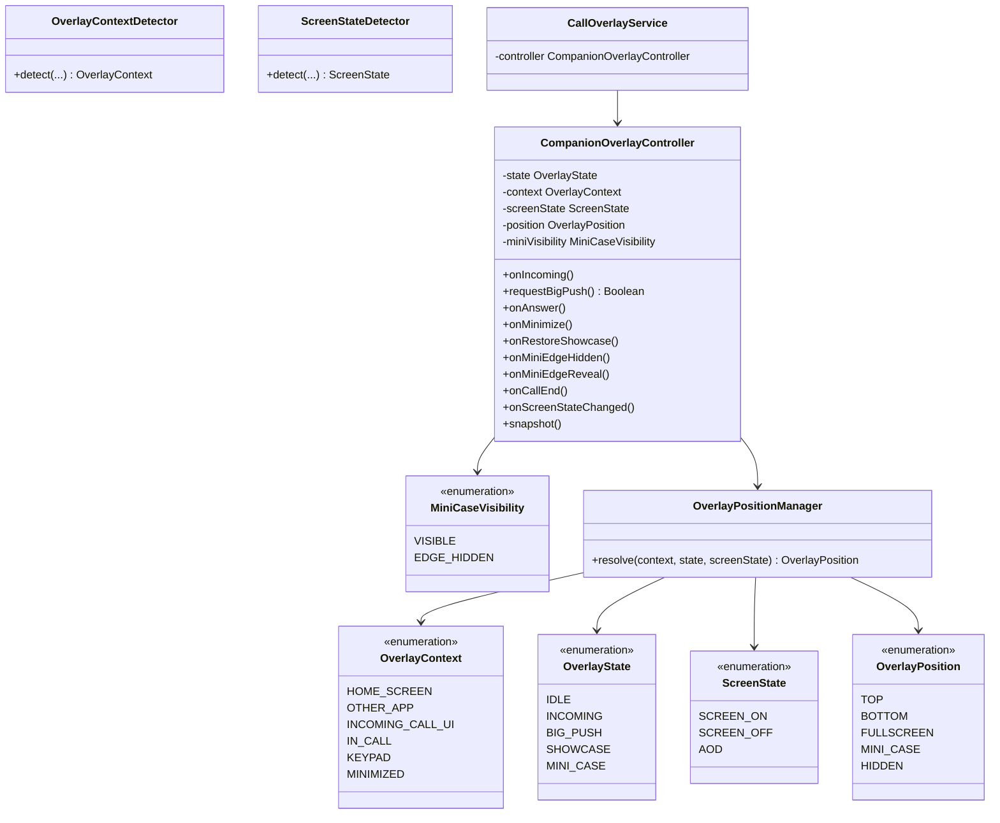

# VLUE Companion Overlay Architecture

> **절대 기준 문서.** BigPush · Showcase · MINI CASE 및 관련 Diagnostics는 이 문서를 기준으로 구현한다.  
> 기존 구현이 본 정책과 충돌하면 기능을 억지로 유지하지 말고 Companion UX 정책에 맞게 리팩터링한다.

코드 위치: `apps/android/app/src/main/java/kr/vlue/calloverlay/companion/`

---

## 1. 제품 정의 (Companion Platform)

VLUE는 **Android 기본 전화 앱을 대체하지 않는 Companion Platform**이다.

| 역할 | 담당 |
|------|------|
| Samsung Phone App / Google Phone / 제조사 전화앱 | **통화 기능** (발신·수신·수락·거절·종료) |
| VLUE | **Call Event를 감지**하여 **Contextual Overlay** 제공 |

VLUE Companion은  
“전화 앱 위에 떠 있는 UI”가 아니라  

**전화 이벤트를 이해하고 상황에 맞는 정보를 제공하는 Companion Layer**  
로 정의한다.

### UX 원칙

- 시스템·기본 전화앱 UI와 **경쟁하지 않는다.**
- 다른 앱 UI를 **방해하지 않는 것**이 최우선이다.
- “가장 빠른 표시”보다 **사용자가 자연스럽게 함께 인지하는 수준**을 목표로 한다.
- 속도 경쟁보다 **이벤트 정합성 · UX 일관성**을 우선한다.

사용자는 먼저 기본 전화앱의 발신자 정보(이름/전화번호)를 확인하고,  
거의 동시에(또는 Ringing 중) 표시되는 VLUE BigPush로 상대방의 **신뢰 정보**를 확인할 수 있다.  
단, BigPush는 **optional**이며 Showcase보다 우선하지 않는다.

---

## 2. Architecture Principles

### 2.1 Showcase 독립 표시 원칙 (필수)

**Showcase는 BigPush 표시 여부와 독립적으로 동작한다.**

- 통화 수락 이벤트(**ANSWER**)를 기준으로 Showcase 표시 상태가 결정된다.
- BigPush 생성 · 제거 · Animation · Timeout 등은 **Showcase 표시를 지연시키면 안 된다.**

```text
금지:
Incoming → BigPush 표시 → (Delay) → Showcase 표시

허용:
Incoming → (optional BigPush) …
         ↘
Call Answer Event → Showcase Display   ← BigPush 경로와 병렬·독립
```

Answer가 오면 BigPush 완료를 기다리지 않고 Showcase Layer를 표시한다.

### 2.2 Event Driven Architecture (필수)

VLUE Companion은 **Event Driven Architecture**를 따른다.  
모든 상태 변화는 **실제 시스템 이벤트**를 기준으로 한다.

**Event 예**

- Incoming Call · Call Answer · Call Reject · Call End  
- Home Press · App Foreground · App Background · Keypad Open  
- Screen On · Screen Off · Overlay Touch · Drag End  

**금지:** `setTimeout` / “N ms 후 Showcase 표시” 같은 **delay 기반 상태 전이**  
**허용:** 실제 **Answer Event** 수신 후 Showcase 표시  

Debounce(예: 중복 Incoming 방지)는 **이벤트 중복 억제**에만 쓰고,  
Showcase/BigPush **표시 시점을 delay로 미루는 용도로 쓰지 않는다.**

---

## 3. Overlay State (단일 상태 · BigPush optional)

동시에 BIG_PUSH / SHOWCASE / MINI_CASE 중 **둘 이상 존재하면 안 된다.**  
**BIGPUSH는 optional state**이다. Showcase보다 우선하지 않는다.



### 최종 흐름 (요약)

```text
IDLE
  → INCOMING
  → BIGPUSH (optional)
  → ANSWER EVENT
  → SHOWCASE
  → MINI_CASE
  → CALL_END
  → IDLE
```

### 허용 전이

| From | Event | To |
|------|-------|-----|
| IDLE | Incoming Call | INCOMING |
| INCOMING | Still ringing + BigPush 허용 | BIGPUSH *(optional)* |
| INCOMING | **Answer Event** (BigPush 전) | SHOWCASE *(BigPush 생성 금지)* |
| BIGPUSH | **Answer Event** | SHOWCASE *(BigPush 즉시 제거, Showcase는 독립 표시)* |
| BIGPUSH / INCOMING | Call Reject / Call End | IDLE |
| SHOWCASE | Home / Other app / Minimize / Keypad | MINI_CASE |
| MINI_CASE | Tap (restore) | SHOWCASE |
| * | Call End | IDLE (모든 Overlay 즉시 제거) |

### 금지

- BigPush와 Showcase 동시 존재  
- Answer 이후 BigPush 생성·표시  
- BigPush 완료/애니메이션을 기다린 뒤 Showcase 표시  
- Call End 후 Overlay 유지 (`ENDED_KEEP`는 Companion MVP에서 비활성)  
- delay(`setTimeout`)로 Showcase/State 전이  

---

## 4. OverlayPosition

```text
OverlayPosition
- TOP
- BOTTOM
- FULLSCREEN
- MINI_CASE
- HIDDEN
```

| Position | 정의 |
|----------|------|
| **TOP** / **BOTTOM** | BigPush 같은 **Notification Overlay** 위치 |
| **FULLSCREEN** | **Showcase 전용 독립 Overlay Layer.** TOP도 BOTTOM도 아니다. 화면 위에 존재하는 Companion Layer |
| **MINI_CASE** | 통화 중 축소 상태의 레이아웃 위치 |
| **HIDDEN** | Overlay가 존재하지 않는 상태 |

> Showcase를 `TOP`으로 표기하지 않는다. Showcase = **FULLSCREEN Companion Layer**.

---

## 5. MiniCaseVisibility

MINI_CASE는 Position만으로 부족하다. **가시성 상태**를 분리한다.

```text
MiniCaseVisibility
- VISIBLE
- EDGE_HIDDEN
```

| Visibility | 동작 |
|------------|------|
| **VISIBLE** | 화면 위 MINI CASE 정상 표시 |
| **EDGE_HIDDEN** | 사용자가 드래그하여 화면 가장자리로 숨김. `[◀]` 형태로 일부만 노출 |

**중요:** `EDGE_HIDDEN`은 종료 상태가 **아니다.**  
Tap Event 발생 시 다시 **VISIBLE**로 복귀한다.  
Call End 시에만 IDLE/HIDDEN으로 정리한다.

---

## 6. ScreenState

Overlay Position(특히 BigPush BOTTOM)은 **화면 상태**에 따라 달라진다.

```text
ScreenState
- SCREEN_ON
- SCREEN_OFF
- AOD
```

| ScreenState | BigPush 정책 |
|-------------|--------------|
| **SCREEN_ON** | Context에 따라 TOP/BOTTOM Notification Overlay 적용 |
| **SCREEN_OFF** / **AOD** | 동일 Bottom Overlay 정책을 **적용하지 않는다** (BigPush는 화면이 켜진 상태에서 의미가 있음). FSI/알림 등 별도 Companion 경로 또는 HIDDEN |

---

## 7. BigPush 정책

- **Ringing**에서만 의미가 있는 **optional** UI.
- 목적: 수락 전 상대 **신뢰 정보** 제공.
- **Answer Event** 시 즉시 제거. Showcase와 독립.
- Answer가 BigPush보다 먼저면 **BigPush를 만들지 않는다.**
- `SCREEN_OFF` / `AOD`에서는 Bottom 정책을 쓰지 않는다.

### BigPush 위치 (Screen ON + OverlayContext)

| OverlayContext | Position |
|----------------|----------|
| `HOME_SCREEN` / `OTHER_APP` | `BOTTOM` |
| `INCOMING_CALL_UI` | `TOP` |
| Answer 이후 | BigPush → `HIDDEN` |

---

## 8. Showcase 정책

- **Answer Event**가 Showcase 표시의 기준이다.
- Showcase = **FULLSCREEN** 독립 Companion Layer.
- BigPush 유무·애니메이션과 **무관**하게 Answer 직후 표시를 시작한다.
- 통화 종료까지 유지하거나 MINI_CASE로만 축소.
- **KPI:** `Answer → Showcase Visible ≤ 1000ms` (이벤트 수신 후 렌더 완료까지의 계측. delay로 KPI를 맞추지 않음)

---

## 9. MINI CASE 정책

Showcase의 축소 형태.

**트리거 Event:** Home · Other app · Minimize · Keypad · 통화 컨트롤 필요  

**표시:** 이름 · 통화 시간 · 전화번호 · 인증 상태 · Showcase 펼치기  

**Visibility:** `VISIBLE` ↔ `EDGE_HIDDEN` (Drag End / Tap)  
**Tap (restore):** SHOWCASE(FULLSCREEN)  
**Call End:** IDLE  

---

## 10. OverlayPositionManager



### OverlayContext

`HOME_SCREEN` · `OTHER_APP` · `INCOMING_CALL_UI` · `IN_CALL` · `KEYPAD` · `MINIMIZED`

### 해석 규칙 (요약)

| State | ScreenState | Context | Position |
|-------|-------------|---------|----------|
| BIG_PUSH | SCREEN_ON | HOME / OTHER_APP | BOTTOM |
| BIG_PUSH | SCREEN_ON | INCOMING_CALL_UI | TOP |
| BIG_PUSH | SCREEN_OFF / AOD | * | HIDDEN *(또는 비-Bottom 대체 경로)* |
| BIG_PUSH | * | IN_CALL 등 | HIDDEN |
| SHOWCASE | * | IN_CALL | **FULLSCREEN** |
| SHOWCASE | * | KEYPAD / MINIMIZED / HOME / OTHER | → 상태 MINI_CASE |
| MINI_CASE | * | * | MINI_CASE (+ MiniCaseVisibility) |
| IDLE | * | * | HIDDEN |

---

## 11. Event → State (Event Driven)

| System Event | 기대 전이 |
|--------------|-----------|
| Incoming Call | IDLE → INCOMING → (optional) BIGPUSH |
| Call Answer | * → SHOWCASE (FULLSCREEN), BigPush 제거 |
| Call Reject / Call End | * → IDLE, Overlay HIDDEN |
| Home / App Background / Keypad Open | SHOWCASE → MINI_CASE (VISIBLE) |
| Overlay Touch (Mini restore) | MINI_CASE → SHOWCASE |
| Drag End (edge) | MiniCaseVisibility → EDGE_HIDDEN |
| Tap on edge peek | EDGE_HIDDEN → VISIBLE |
| Screen On / Off | BigPush 허용 여부·Position 재평가 |

---

## 12. Class Diagram



---

## 13. Diagnostics

이벤트/스냅샷에 기록:

- `overlayState` — IDLE | INCOMING | BIG_PUSH | SHOWCASE | MINI_CASE  
- `overlayContext`  
- `overlayPosition` — TOP | BOTTOM | **FULLSCREEN** | MINI_CASE | HIDDEN  
- `miniCaseVisibility` — VISIBLE | EDGE_HIDDEN  
- `screenState` — SCREEN_ON | SCREEN_OFF | AOD  
- `triggerEvent` — 전이를 일으킨 시스템 이벤트명  

Performance Timeline (유지, **이벤트 기준 계측**):

- Incoming → BigPush *(optional)*  
- **Answer → Showcase** *(BigPush와 독립 KPI)*  
- React Init / DCC Bind / Showcase Visible  

KPI:

- Answer → Showcase Visible ≤ **1000ms**  
- BigPush는 optional · Ringing · SCREEN_ON 중심  

---

## 14. UX KPI 체크리스트

1. VLUE는 전화앱을 대체하지 않는 Companion Layer이다.  
2. Showcase는 **Answer Event**로 구동되며 BigPush에 종속되지 않는다.  
3. 상태 전이는 **delay가 아니라 시스템 이벤트**로 한다.  
4. BigPush는 optional · Ringing · SCREEN_ON에서만 의미가 있다.  
5. Showcase Position은 **FULLSCREEN**이다 (TOP/BOTTOM 아님).  
6. MINI_CASE는 `VISIBLE` / `EDGE_HIDDEN`을 가지며 EDGE_HIDDEN은 종료가 아니다.  
7. Call End 시 모든 Overlay가 즉시 제거된다.

---

## 15. 구현 진입점

| 구성요소 | 파일 |
|----------|------|
| State / Context / Position / Screen / Mini visibility | `companion/*.kt` |
| PositionManager | `companion/OverlayPositionManager.kt` |
| Controller | `companion/CompanionOverlayController.kt` |
| Window 적용 | `CallOverlayService.kt` |
| Call Events | `LetteringCallReceiver` · `LetteringCallMonitorService` · `VlueInCallService` · `LetteringCallCoordinator` |
| Native Bridge | `LetteringJavascriptBridge.kt` |

**이후 Overlay 기능은 반드시 이 문서를 읽고 Controller · Event 전이를 통해 구현한다.**
