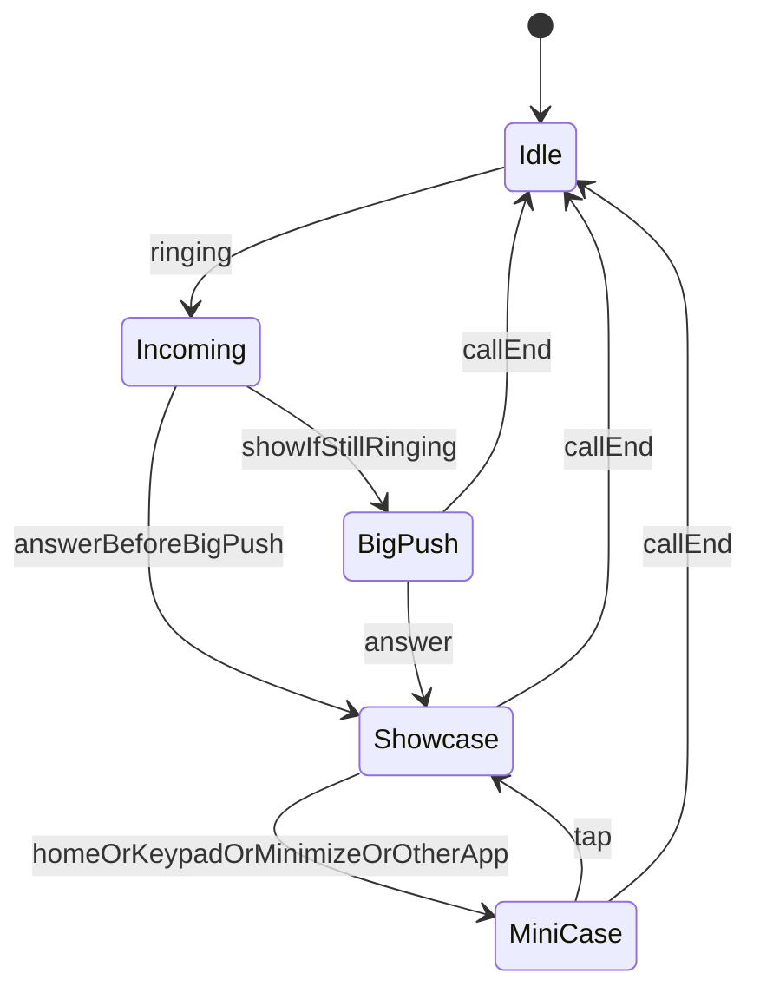
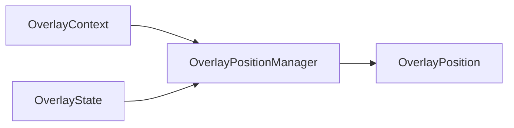
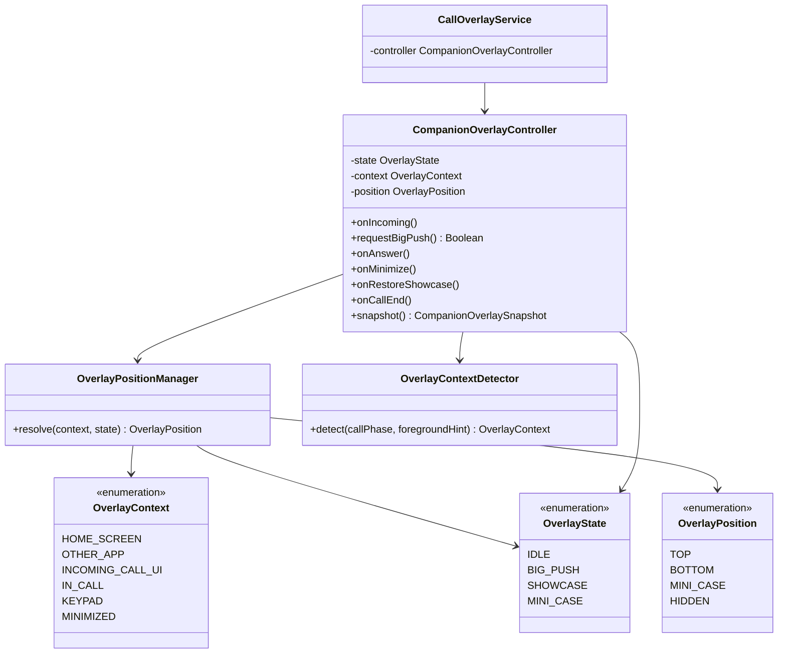

# VLUE Companion Overlay Architecture

> **절대 기준 문서.** BigPush · Showcase · MINI CASE 및 관련 Diagnostics는 이 문서를 기준으로 구현한다.  
> 기존 구현이 본 정책과 충돌하면 기능을 억지로 유지하지 말고 Companion UX 정책에 맞게 리팩터링한다.

코드 위치: `apps/android/app/src/main/java/kr/vlue/calloverlay/companion/`

---

## 1. 제품 철학

VLUE는 **기본 전화앱을 대체하지 않는다.**

삼성 전화앱, Google Phone, 제조사 기본 전화앱을 그대로 사용한다.  
VLUE는 **Companion Overlay**로 동작하며, 시스템 UI와 경쟁하지 않는다.

- 기본 전화앱·다른 앱 UI를 **방해하지 않는 것**이 최우선이다.
- “가장 빠른 표시”보다 **사용자가 자연스럽게 함께 인지하는 수준**의 표시를 목표로 한다.
- 속도 경쟁보다 **UX 일관성**을 우선한다.

사용자는 먼저 기본 전화앱의 발신자 정보(이름/전화번호)를 확인하고,  
거의 동시에 표시되는 VLUE BigPush로 상대방의 **신뢰 정보**를 확인한다.

---

## 2. Overlay State (단일 상태만 허용)

동시에 BIG_PUSH / SHOWCASE / MINI_CASE 중 **둘 이상 존재하면 안 된다.**

### 허용 전이

| From | Event | To |
|------|-------|-----|
| Idle | Incoming / Ringing | Incoming (내부) → BigPush 또는 Showcase |
| Incoming | Still ringing + overlay ready | BigPush |
| Incoming / Idle | Answer before BigPush | Showcase (BigPush 생성 금지) |
| BigPush | Answer | Showcase (BigPush 즉시 제거) |
| Showcase | Home / Other app / Minimize / Keypad | MiniCase |
| MiniCase | Tap | Showcase |
| * | Call End | Idle (모든 Overlay 즉시 제거) |

### 금지

- BigPush와 Showcase 동시 존재
- Answer 이후 BigPush 생성·표시
- Call End 후 Overlay 유지 (`ENDED_KEEP`는 Companion MVP에서 비활성)

---

## 3. BigPush 정책

- **Ringing(수신 대기)에서만** 의미가 있다.
- 목적: 수신 수락 전에 상대 **신뢰 정보** 제공.
- 통화 수락 순간 **즉시 제거**한다.
- BigPush가 뜨기 전에 Answer가 발생하면 **BigPush를 만들지 않고** Showcase로 진입한다.
- 목적이 사라진 뒤 늦게 BigPush가 뜨면 안 된다.

### BigPush 위치 (`OverlayPositionManager`)

| OverlayContext | Position |
|----------------|----------|
| `HOME_SCREEN` / `OTHER_APP` | `BOTTOM` |
| `INCOMING_CALL_UI` | `TOP` |
| Answer 이후 (`IN_CALL` 등) | BigPush → `HIDDEN` (생성 금지) |

- HOME/OTHER_APP: 하단 Companion 알림형 — 다른 앱·미니콜 UI 방해 최소화  
- INCOMING_CALL_UI: 상단 — 하단 수신 버튼·제스처와 충돌 금지  

---

## 4. Showcase 정책

- Answer 시 BigPush 제거 후 Showcase 표시.
- 통화 중 기본 Companion UI. 통화 종료까지 유지(또는 MiniCase로만 축소).
- **KPI:** `Answer → Showcase Visible ≤ 1000ms`

---

## 5. MINI CASE 정책

Showcase의 축소 형태. 트리거:

- 홈 / 다른 앱 / 사용자 축소 / 키패드 / 통화 컨트롤 필요 시

표시: 이름 · 통화 시간 · 전화번호 · 인증 상태 · Showcase 펼치기  
Tap → Showcase 복원. Call End → Idle.

---

## 6. OverlayPositionManager

### OverlayContext

`HOME_SCREEN` · `OTHER_APP` · `INCOMING_CALL_UI` · `IN_CALL` · `KEYPAD` · `MINIMIZED`

### OverlayPosition

`TOP` · `BOTTOM` · `MINI_CASE` · `HIDDEN`

### 해석 규칙 (요약)

| State | Context | Position |
|-------|---------|----------|
| BIG_PUSH | HOME_SCREEN, OTHER_APP | BOTTOM |
| BIG_PUSH | INCOMING_CALL_UI | TOP |
| BIG_PUSH | IN_CALL, KEYPAD, MINIMIZED | HIDDEN |
| SHOWCASE | IN_CALL | TOP (fullscreen; 위치 의미는 전체 화면) |
| SHOWCASE | KEYPAD, MINIMIZED, HOME, OTHER_APP | → 전이 대상 MINI_CASE |
| MINI_CASE | * | MINI_CASE |
| IDLE | * | HIDDEN |

---

## 7. Class Diagram

---

## 8. Diagnostics

모든 Overlay 관련 이벤트/스냅샷에 기록:

- `overlayState` — BIG_PUSH | SHOWCASE | MINI_CASE | IDLE  
- `overlayContext` — HOME_SCREEN | …  
- `overlayPosition` — TOP | BOTTOM | MINI_CASE | HIDDEN  

Performance Timeline (유지):

- Incoming → BigPush  
- Answer → Showcase  
- React Init / DCC Bind / Showcase Visible  

KPI:

- Answer → Showcase Visible ≤ **1000ms**  
- BigPush는 “기본 전화앱과 거의 동시 인지” 수준 (속도 경쟁 KPI보다 UX 일관성 우선)

---

## 9. UX KPI 체크리스트

1. BigPush가 기본 전화앱 발신자 확인 흐름을 방해하지 않는다.  
2. BigPush는 Ringing에서만 존재한다.  
3. Answer가 BigPush보다 먼저면 BigPush를 생성하지 않는다.  
4. Answer → Showcase Visible ≤ 1000ms.  
5. Call End 시 모든 Overlay가 즉시 제거된다.

---

## 10. 구현 진입점

| 구성요소 | 파일 |
|----------|------|
| State / Context / Position | `companion/OverlayState.kt` 등 |
| PositionManager | `companion/OverlayPositionManager.kt` |
| Controller | `companion/CompanionOverlayController.kt` |
| Context 감지 | `companion/OverlayContextDetector.kt` |
| Window 적용 | `CallOverlayService.kt` |

**이후 Overlay 기능은 반드시 이 문서를 읽고 Controller 전이를 통해 구현한다.**
