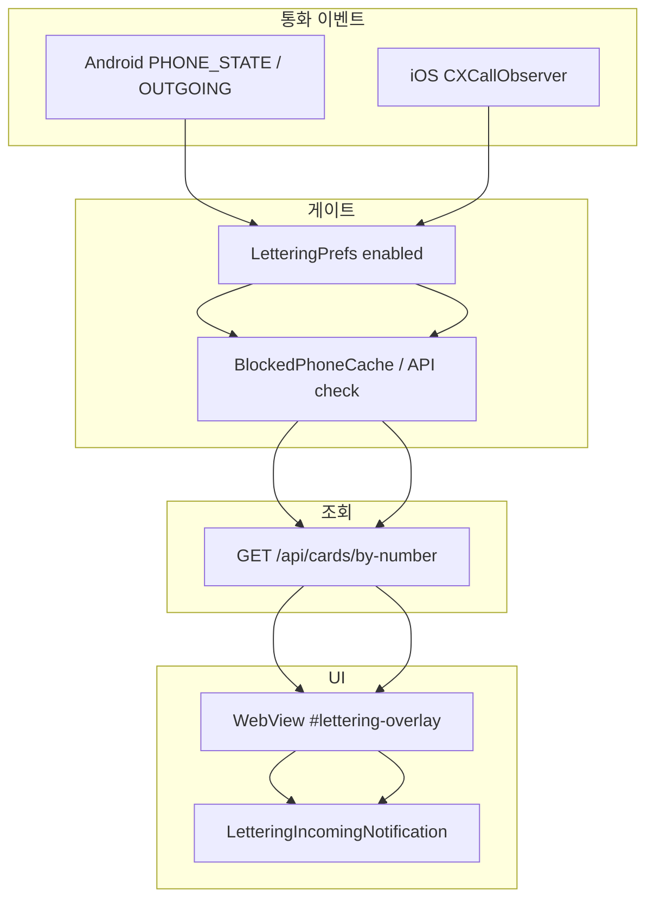

# VLUE Lettering — 메인 앱 통합 가이드

## 아키텍처



## 웹

| 진입 | URL |
|------|-----|
| 미리보기 | `#lettering-preview` |
| 네이티브 오버레이 | `#lettering-overlay?incoming=...&platform=android\|ios&native=1` |

| 설정 | `ProfilePanel` → 채팅 프로필 설정 → **VLUE 레터링** (`LetteringSettingsSection`) |

| API | `POST /api/lettering/blocks`, `POST /api/lettering/reports`, `GET /api/lettering/blocks/check` |

## Android (`apps/android-call-overlay`)

1. 기존 `MainActivity`에 `MainJsBridge` / `LetteringPermissionHelper` merge
2. `settings.gradle.kts`에 `include(":call-overlay")` 또는 소스 복사
3. `BuildConfig.WEB_BASE_URL` / `API_BASE_URL` 프로덕션 URL 설정
4. `LetteringPrefs.setSession(userId, token)` — 로그인 후 호출

## iOS (`apps/ios-lettering/Sources`)

1. Xcode 타겟에 Swift 파일 추가
2. `AppDelegate`에서 `LetteringCallObserver.shared.start()`
3. 번호 확보 시 `LetteringOverlayPresenter.shared.present(phone:verified:outgoing:)`
4. WKWebView 메인 앱에 `vlueLetteringSettings` 핸들러 등록

## DB 마이그레이션

```bash
cd packages/db
# shadow DB 이슈 시 (권장 — 이미 적용됨):
npm run migrate:lettering
npm run verify:lettering
```

`lettering_phone_blocks.owner_id` → `users.id`  
`lettering_phone_reports.reporter_id` → `users.id` (ON DELETE/UPDATE CASCADE)

기존 실패 마이그레이션(`20260504163349_vlue_business_cards_feed`)이 있으면 `prisma migrate resolve` 후 deploy.

## 버튼 액션

| 버튼 | 동작 |
|------|------|
| 인증정보 | 앱 내 `LetteringCertModal` / `vlue-lettering-open-cert` |
| 명함저장 | `saveLetteringCardToWallet` → localStorage 지갑 |
| 신고/차단 | `POST /api/lettering/reports` + 차단 → 오버레이 미표시 |
